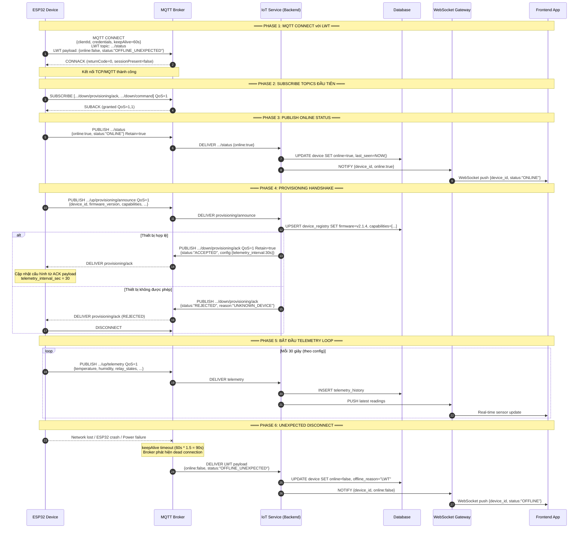
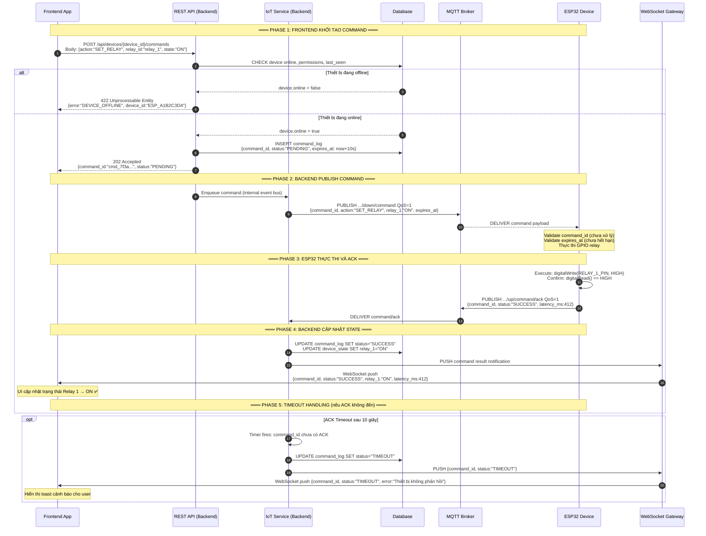

# 📡 IoT System Flow Document
## Kiến trúc Indirect Communication Pattern (ESP32 → MQTT Only)

> **Phiên bản:** 1.0.0 | **Ngày:** 2026-07-16 | **Tác giả:** Lead IoT Solutions Architect

---

## Mục lục

1. [Phân tích Pain Points hiện tại](#1-phân-tích-pain-points-hiện-tại)
2. [Tổng quan Kiến trúc mới](#2-tổng-quan-kiến-trúc-mới)
3. [State Management & Data Flow — MQTT Topics & Payloads](#3-state-management--data-flow)
4. [Sequence Diagrams](#4-sequence-diagrams)
5. [Transition Strategy](#5-transition-strategy)
6. [Bảng tổng hợp MQTT Topics](#6-bảng-tổng-hợp-mqtt-topics)

---

## 1. Phân tích Pain Points hiện tại

### 1.1 Kiến trúc cũ — Dual-Connection (Problematic)

```
┌─────────────────────────────────────────────────────────────────┐
│                     KIẾN TRÚC CŨ (Anti-pattern)                 │
│                                                                  │
│  ┌──────────┐  ──MQTT──▶  ┌──────────────┐                      │
│  │          │              │ MQTT Broker  │                      │
│  │  ESP32   │              └──────────────┘                      │
│  │          │                                                     │
│  │          │  ──HTTP──▶  ┌──────────────┐  ──▶  ┌──────────┐  │
│  └──────────┘             │  Backend API  │       │ Database │  │
│                           └──────────────┘        └──────────┘  │
└─────────────────────────────────────────────────────────────────┘
```

### 1.2 Danh sách Pain Points

| # | Pain Point | Mức độ nghiêm trọng | Nguyên nhân gốc rễ |
|---|------------|--------------------|--------------------|
| 1 | **High resource consumption** trên ESP32 | 🔴 Critical | Phải duy trì song song cả TCP stack cho HTTP lẫn MQTT socket |
| 2 | **Sync issues** — dữ liệu MQTT và HTTP lệch nhau | 🔴 Critical | Không có single source of truth; race condition giữa 2 channel |
| 3 | **Reconnection complexity** — ESP32 phải handle 2 loại connection failure | 🟠 High | Logic retry riêng biệt cho HTTP và MQTT |
| 4 | **High maintenance overhead** — firmware update phải đụng vào cả 2 stack | 🟠 High | Coupling giữa HTTP client library và MQTT client library |
| 5 | **Security surface area** lớn hơn | 🟡 Medium | ESP32 cần lưu cả MQTT credentials lẫn API keys/tokens |
| 6 | **Offline mode không nhất quán** — MQTT offline event không reflect state HTTP | 🟡 Medium | LWT chỉ hoạt động trên MQTT, không sync với HTTP session |
| 7 | **Khó debug và trace** một request end-to-end | 🟡 Medium | Request đi qua 2 channel khác nhau, log phân tán |

---

## 2. Tổng quan Kiến trúc mới

### 2.1 Nguyên tắc kiến trúc cốt lõi (Architecture Principles)

> [!IMPORTANT]
> **RULE #1 — Single Channel Contract**: ESP32 **PHẢI TUYỆT ĐỐI** chỉ giao tiếp với MQTT Broker. **NGHIÊM CẤM** gọi trực tiếp bất kỳ HTTP endpoint nào của Backend.

> [!IMPORTANT]
> **RULE #2 — Backend là Consumer, không phải Endpoint**: Backend subscribe MQTT topics và react theo; nó không expose bất kỳ endpoint nào để device gọi trực tiếp.

> [!NOTE]
> **RULE #3 — Asynchronous by Default**: Toàn bộ device-to-cloud communication là async. Command/Response theo pattern Request-Response qua MQTT topics.

### 2.2 Architecture Topology (High-Level)

```
╔══════════════════════════════════════════════════════════════════════════════════╗
║                      KIẾN TRÚC MỚI — INDIRECT COMMUNICATION PATTERN            ║
╠══════════════════════════════════════════════════════════════════════════════════╣
║                                                                                  ║
║  ┌──────────────────┐         ┌───────────────────┐        ┌──────────────────┐ ║
║  │   DEVICE LAYER   │         │   BROKER LAYER    │        │  SERVICE LAYER   │ ║
║  │                  │         │                   │        │                  │ ║
║  │  ┌────────────┐  │ PUBLISH │ ┌───────────────┐ │ SUB   │ ┌──────────────┐ │ ║
║  │  │            │──┼────────▶│ │               │─┼──────▶│ │  IoT Service │ │ ║
║  │  │   ESP32    │  │         │ │  MQTT Broker  │ │        │ │  (Backend)   │ │ ║
║  │  │            │◀─┼─────────┼─│               │◀┼───────┼─│              │ │ ║
║  │  └────────────┘  │ SUB     │ └───────────────┘ │ PUB   │ └──────┬───────┘ │ ║
║  │                  │         │                   │        │        │         │ ║
║  │  Chỉ MQTT!       │         │  Single Source    │        │  ┌─────▼──────┐  │ ║
║  │  Không HTTP!     │         │  of Truth         │        │  │  Database  │  │ ║
║  └──────────────────┘         └───────────────────┘        │  └────────────┘  │ ║
║                                                             │                  │ ║
║                                                             │  ┌────────────┐  │ ║
║                                                             │  │  WebSocket │  │ ║
║                                                             │  │  Gateway   │  │ ║
║                                                             │  └─────┬──────┘  │ ║
║                                                             └────────┼─────────┘ ║
║                                                                      │           ║
║                                                             ┌────────▼─────────┐ ║
║                                                             │  FRONTEND LAYER  │ ║
║                                                             │  (Web/Mobile App)│ ║
║                                                             └──────────────────┘ ║
╚══════════════════════════════════════════════════════════════════════════════════╝
```

### 2.3 Component Boundaries

| Component | Vai trò | Giao tiếp với | Protocol |
|-----------|---------|---------------|----------|
| **ESP32 (Device)** | Thu thập sensor data, thực thi commands | MQTT Broker only | MQTT 3.1.1 / 5.0 |
| **MQTT Broker** | Message routing, session management, LWT | ESP32, Backend | MQTT |
| **IoT Service (Backend)** | Business logic, command orchestration, DB sync | MQTT Broker, Database, WebSocket Gateway | MQTT (pub/sub), SQL/NoSQL |
| **WebSocket Gateway** | Real-time push tới Frontend | IoT Service, Frontend | WebSocket / SSE |
| **Frontend App** | Hiển thị data, gửi commands qua Backend | WebSocket Gateway, REST API Backend | HTTP/WS |
| **Database** | Lưu trữ trạng thái thiết bị, lịch sử telemetry | IoT Service | SQL/NoSQL |

---

## 3. State Management & Data Flow

### 3.1 MQTT Topic Naming Convention

```
Cấu trúc:  {tenant}/{device_type}/{device_id}/{direction}/{feature}
Ví dụ:     acme/esp32/{device_id}/up/telemetry

Giải thích:
  - {tenant}      : Tên tổ chức/project (e.g., "acme", "iot-prod")
  - {device_type} : Loại thiết bị (e.g., "esp32", "sensor-node")
  - {device_id}   : ID duy nhất của từng thiết bị (e.g., "ESP_A1B2C3D4")
  - {direction}   : "up" (device→cloud) | "down" (cloud→device)
  - {feature}     : Chức năng cụ thể
```

---

### 3.2 Flow 1: Provisioning / Handshake

**Mục đích:** ESP32 đăng ký với hệ thống ngay khi boot, Backend xác nhận thiết bị hợp lệ và cấp phát cấu hình.

#### Topic: Device Announce (Uplink)
```
TOPIC:  {tenant}/esp32/{device_id}/up/provisioning/announce
QoS:    1
Retain: false
```

**Payload (ESP32 → Broker → Backend):**
```json
{
  "$schema": "https://iot.acme.com/schema/v1/provision-announce",
  "device_id": "ESP_A1B2C3D4",
  "firmware_version": "2.1.4",
  "hardware_revision": "REV-C",
  "mac_address": "AA:BB:CC:DD:EE:FF",
  "chip_model": "ESP32-WROOM-32",
  "capabilities": ["temperature", "humidity", "relay_control"],
  "timestamp_utc": "2026-07-16T06:54:00Z",
  "boot_reason": "POWER_ON",
  "free_heap_bytes": 245760
}
```

#### Topic: Provisioning ACK (Downlink — Backend trả về)
```
TOPIC:  {tenant}/esp32/{device_id}/down/provisioning/ack
QoS:    1
Retain: true
```

**Payload (Backend → Broker → ESP32):**
```json
{
  "$schema": "https://iot.acme.com/schema/v1/provision-ack",
  "status": "ACCEPTED",
  "device_id": "ESP_A1B2C3D4",
  "assigned_config": {
    "telemetry_interval_sec": 30,
    "command_timeout_sec": 10,
    "reporting_qos": 1
  },
  "server_timestamp_utc": "2026-07-16T06:54:01Z",
  "session_token": "eyJhbGciOiJIUzI1NiJ9..."
}
```

> [!NOTE]
> **Retain flag = true** trên ACK topic đảm bảo ESP32 nhận được config ngay cả khi nó subscribe sau khi Backend publish.

---

### 3.3 Flow 2: Telemetry / Sensor Data (Uplink)

**Mục đích:** ESP32 định kỳ publish dữ liệu cảm biến lên cloud.

#### Topic: Telemetry Publish
```
TOPIC:  {tenant}/esp32/{device_id}/up/telemetry
QoS:    1
Retain: false
```

**Payload (ESP32 → Broker → Backend):**
```json
{
  "$schema": "https://iot.acme.com/schema/v1/telemetry",
  "device_id": "ESP_A1B2C3D4",
  "sequence_number": 1042,
  "timestamp_utc": "2026-07-16T06:54:30Z",
  "readings": {
    "temperature_celsius": 28.5,
    "humidity_percent": 65.2,
    "pressure_hpa": 1013.25,
    "battery_voltage": 3.72,
    "rssi_dbm": -67
  },
  "actuator_states": {
    "relay_1": "ON",
    "relay_2": "OFF",
    "led_status": "BLINKING"
  },
  "metadata": {
    "uptime_sec": 31207,
    "free_heap_bytes": 243200,
    "wifi_reconnect_count": 2
  }
}
```

> [!TIP]
> **sequence_number** giúp Backend phát hiện packet loss và out-of-order delivery mà không cần timestamp phức tạp.

---

### 3.4 Flow 3: Command & Control (Downlink) + ACK Pattern

**Mục đích:** Backend (được kích hoạt bởi Frontend) gửi lệnh điều khiển xuống ESP32, ESP32 thực thi và xác nhận kết quả.

#### Step A — Backend gửi Command xuống ESP32
```
TOPIC:  {tenant}/esp32/{device_id}/down/command
QoS:    1
Retain: false
```

**Payload (Backend → Broker → ESP32):**
```json
{
  "$schema": "https://iot.acme.com/schema/v1/command",
  "command_id": "cmd_7f3a9b2e-4c1d-4e5f-a8b9-c0d1e2f3a4b5",
  "device_id": "ESP_A1B2C3D4",
  "issued_by": "user_admin_001",
  "timestamp_utc": "2026-07-16T07:00:00Z",
  "expires_at_utc": "2026-07-16T07:00:10Z",
  "action": "SET_RELAY",
  "parameters": {
    "relay_id": "relay_1",
    "state": "ON",
    "duration_sec": 0
  }
}
```

#### Step B — ESP32 gửi ACK sau khi thực thi
```
TOPIC:  {tenant}/esp32/{device_id}/up/command/ack
QoS:    1
Retain: false
```

**Payload (ESP32 → Broker → Backend):**
```json
{
  "$schema": "https://iot.acme.com/schema/v1/command-ack",
  "command_id": "cmd_7f3a9b2e-4c1d-4e5f-a8b9-c0d1e2f3a4b5",
  "device_id": "ESP_A1B2C3D4",
  "status": "SUCCESS",
  "executed_at_utc": "2026-07-16T07:00:00Z",
  "ack_timestamp_utc": "2026-07-16T07:00:00Z",
  "latency_ms": 412,
  "result": {
    "relay_id": "relay_1",
    "actual_state": "ON",
    "confirmation": "GPIO_CONFIRMED"
  },
  "error": null
}
```

**Payload khi thất bại:**
```json
{
  "$schema": "https://iot.acme.com/schema/v1/command-ack",
  "command_id": "cmd_7f3a9b2e-4c1d-4e5f-a8b9-c0d1e2f3a4b5",
  "device_id": "ESP_A1B2C3D4",
  "status": "FAILED",
  "executed_at_utc": "2026-07-16T07:00:01Z",
  "ack_timestamp_utc": "2026-07-16T07:00:01Z",
  "latency_ms": 1203,
  "result": null,
  "error": {
    "code": "GPIO_FAULT",
    "message": "Relay driver không phản hồi sau 1000ms",
    "retry_eligible": true
  }
}
```

---

### 3.5 Flow 4: Keep-Alive & LWT (Last Will and Testament)

**Mục đích:** Hệ thống tự động phát hiện ESP32 offline bất thường (mất điện, mất wifi, crash firmware) mà không cần polling.

#### LWT Configuration (ESP32 cài đặt khi CONNECT)

**LWT Topic:**
```
TOPIC:  {tenant}/esp32/{device_id}/status
QoS:    1
Retain: true
```

**LWT Payload (Broker tự động publish khi ESP32 ngắt kết nối bất thường):**
```json
{
  "device_id": "ESP_A1B2C3D4",
  "online": false,
  "status": "OFFLINE_UNEXPECTED",
  "last_seen_utc": null,
  "reason": "LWT_TRIGGERED"
}
```

**Online Payload (ESP32 tự publish khi kết nối thành công):**
```json
{
  "device_id": "ESP_A1B2C3D4",
  "online": true,
  "status": "ONLINE",
  "connected_at_utc": "2026-07-16T06:54:00Z",
  "reason": "NORMAL_CONNECT"
}
```

**Graceful Disconnect Payload (ESP32 publish trước khi ngắt kết nối chủ động):**
```json
{
  "device_id": "ESP_A1B2C3D4",
  "online": false,
  "status": "OFFLINE_GRACEFUL",
  "disconnected_at_utc": "2026-07-16T08:00:00Z",
  "reason": "PLANNED_SHUTDOWN"
}
```

> [!IMPORTANT]
> **Retain = true** trên `/status` topic đảm bảo bất kỳ subscriber mới nào (ví dụ Frontend vừa mở app) đều nhận được trạng thái online/offline mới nhất của thiết bị ngay lập tức.

---

## 4. Sequence Diagrams

### 4.1 Flow 1: Device Bootstrapping & Online Status



---

### 4.2 Flow 2: Control Command Execution



---

## 5. Transition Strategy

### 5.1 Tổng quan Lộ trình Migration

```
Hiện tại (Messy)          Giai đoạn 1              Giai đoạn 2              Mục tiêu (Clean)
─────────────────         ─────────────             ─────────────            ─────────────────
ESP32 → MQTT Broker  ──▶  Giữ MQTT, thêm   ──▶     Backend xử lý   ──▶     ESP32 → MQTT Only
ESP32 → HTTP Backend      LWT + Handshake           command qua MQTT         Backend as Consumer
                                                    (song song HTTP)         HTTP bị loại bỏ
```

---

### 5.2 Giai đoạn 1 — Foundation (Tuần 1–2)

**Mục tiêu:** Thiết lập MQTT infrastructure chuẩn; Backend bắt đầu consume MQTT mà không phá vỡ HTTP hiện có.

#### 5.2.1 Backend Changes

**Bước 1.1 — Tích hợp MQTT Client vào Backend**
```python
# Ví dụ với Python/FastAPI + paho-mqtt
import paho.mqtt.client as mqtt

class IoTMQTTConsumer:
    def __init__(self, broker_host, broker_port):
        self.client = mqtt.Client(client_id="iot-backend-service")
        self.client.on_connect = self.on_connect
        self.client.on_message = self.on_message
        self.client.connect(broker_host, broker_port, keepalive=60)

    def on_connect(self, client, userdata, flags, rc):
        # Subscribe toàn bộ device telemetry và provisioning
        client.subscribe("acme/esp32/+/up/telemetry", qos=1)
        client.subscribe("acme/esp32/+/up/provisioning/announce", qos=1)
        client.subscribe("acme/esp32/+/up/command/ack", qos=1)
        client.subscribe("acme/esp32/+/status", qos=1)

    def on_message(self, client, userdata, msg):
        topic_parts = msg.topic.split("/")
        feature = topic_parts[-1]
        device_id = topic_parts[2]
        payload = json.loads(msg.payload)
        # Route tới handler tương ứng
        self.dispatch(feature, device_id, payload)
```

**Bước 1.2 — Implement LWT Subscribe**
- Backend subscribe `acme/esp32/+/status` với QoS 1.
- Khi nhận message `online: false`, cập nhật DB và push WebSocket notify tới Frontend.

**Bước 1.3 — Provisioning Handler**
- Implement handler cho topic `provisioning/announce`.
- Validate device_id trong database.
- Publish ACK lên topic `down/provisioning/ack` với Retain=true.

#### 5.2.2 ESP32 Firmware Changes (Minimal)

**Bước 1.4 — Thêm LWT vào MQTT CONNECT**
```cpp
// Arduino/ESP-IDF example
void setupMQTT() {
    String lwt_topic = String("acme/esp32/") + DEVICE_ID + "/status";
    String lwt_payload = "{\"device_id\":\"" + DEVICE_ID + "\",\"online\":false,\"status\":\"OFFLINE_UNEXPECTED\"}";
    
    mqttClient.setWill(
        lwt_topic.c_str(),
        lwt_payload.c_str(),
        true,  // retain
        1      // QoS
    );
    mqttClient.connect(DEVICE_ID, MQTT_USER, MQTT_PASS);
    
    // Publish online status ngay sau khi connect
    String online_payload = "{\"device_id\":\"" + DEVICE_ID + "\",\"online\":true,\"status\":\"ONLINE\"}";
    mqttClient.publish(lwt_topic.c_str(), online_payload.c_str(), true);
}
```

**Bước 1.5 — Thêm Provisioning Announce**
```cpp
void publishProvisioning() {
    String topic = "acme/esp32/" + String(DEVICE_ID) + "/up/provisioning/announce";
    DynamicJsonDocument doc(512);
    doc["device_id"] = DEVICE_ID;
    doc["firmware_version"] = FIRMWARE_VERSION;
    doc["mac_address"] = WiFi.macAddress();
    doc["capabilities"] = capabilities_array; // ["temperature","relay_control"]
    doc["boot_reason"] = getBootReason();
    doc["timestamp_utc"] = getNTPTime();
    
    String payload;
    serializeJson(doc, payload);
    mqttClient.publish(topic.c_str(), payload.c_str(), false);
}
```

> [!NOTE]
> **Không xóa HTTP client ngay**. Giai đoạn này chạy song song để đảm bảo không có downtime.

---

### 5.3 Giai đoạn 2 — Command Migration (Tuần 3–4)

**Mục tiêu:** Chuyển Command & Control từ HTTP về MQTT. Đây là bước phức tạp nhất.

#### 5.3.1 Backend — Implement Command Publisher

**Bước 2.1 — Tạo Command Orchestration Service**
```python
class CommandOrchestrator:
    def __init__(self, mqtt_client, db):
        self.mqtt = mqtt_client
        self.db = db
        self.pending_commands = {}  # command_id -> asyncio.Event

    async def send_command(self, device_id: str, action: str, params: dict) -> dict:
        command_id = str(uuid.uuid4())
        expires_at = datetime.utcnow() + timedelta(seconds=10)

        payload = {
            "command_id": command_id,
            "device_id": device_id,
            "action": action,
            "parameters": params,
            "issued_by": "system",
            "timestamp_utc": datetime.utcnow().isoformat() + "Z",
            "expires_at_utc": expires_at.isoformat() + "Z"
        }

        # Lưu vào DB với status PENDING
        await self.db.insert_command(command_id, status="PENDING")
        
        # Publish xuống MQTT
        topic = f"acme/esp32/{device_id}/down/command"
        self.mqtt.publish(topic, json.dumps(payload), qos=1)
        
        # Chờ ACK với timeout
        ack_event = asyncio.Event()
        self.pending_commands[command_id] = ack_event
        
        try:
            await asyncio.wait_for(ack_event.wait(), timeout=10.0)
            return {"command_id": command_id, "status": "SUCCESS"}
        except asyncio.TimeoutError:
            await self.db.update_command(command_id, status="TIMEOUT")
            return {"command_id": command_id, "status": "TIMEOUT"}
        finally:
            self.pending_commands.pop(command_id, None)

    def handle_ack(self, ack_payload: dict):
        command_id = ack_payload["command_id"]
        if command_id in self.pending_commands:
            self.pending_commands[command_id].set()
```

**Bước 2.2 — API Endpoint gọi CommandOrchestrator thay vì gửi HTTP tới device**
```python
@router.post("/api/devices/{device_id}/commands")
async def create_command(device_id: str, body: CommandRequest):
    # Check device online
    device = await db.get_device(device_id)
    if not device.online:
        raise HTTPException(422, "DEVICE_OFFLINE")
    
    # Dùng CommandOrchestrator thay vì trực tiếp gọi device HTTP
    result = await command_orchestrator.send_command(
        device_id=device_id,
        action=body.action,
        params=body.parameters
    )
    return result
```

#### 5.3.2 ESP32 Firmware — Implement Command Subscriber

**Bước 2.3 — Subscribe Command Topic và xử lý**
```cpp
void mqttCallback(char* topic, byte* payload, unsigned int length) {
    String topicStr = String(topic);
    DynamicJsonDocument doc(512);
    deserializeJson(doc, payload, length);
    
    if (topicStr.endsWith("/down/command")) {
        handleCommand(doc);
    } else if (topicStr.endsWith("/down/provisioning/ack")) {
        handleProvisioningAck(doc);
    }
}

void handleCommand(DynamicJsonDocument& doc) {
    String command_id = doc["command_id"].as<String>();
    String action = doc["action"].as<String>();
    String expires_at = doc["expires_at_utc"].as<String>();
    
    // Kiểm tra command chưa hết hạn
    if (isExpired(expires_at)) {
        publishCommandAck(command_id, "EXPIRED", "Command đã hết hạn");
        return;
    }
    
    // Thực thi command
    bool success = false;
    String error_msg = "";
    
    if (action == "SET_RELAY") {
        String relay_id = doc["parameters"]["relay_id"].as<String>();
        String state = doc["parameters"]["state"].as<String>();
        success = executeRelayCommand(relay_id, state, &error_msg);
    } else {
        error_msg = "Unsupported action: " + action;
    }
    
    // Publish ACK
    publishCommandAck(command_id, success ? "SUCCESS" : "FAILED", error_msg);
}

void publishCommandAck(String command_id, String status, String error_msg) {
    String topic = "acme/esp32/" + String(DEVICE_ID) + "/up/command/ack";
    DynamicJsonDocument ack(512);
    ack["command_id"] = command_id;
    ack["device_id"] = DEVICE_ID;
    ack["status"] = status;
    ack["ack_timestamp_utc"] = getNTPTime();
    if (error_msg.length() > 0) {
        ack["error"]["message"] = error_msg;
    }
    String ackPayload;
    serializeJson(ack, ackPayload);
    mqttClient.publish(topic.c_str(), ackPayload.c_str(), false);
}
```

**Bước 2.4 — Feature Flag: Chạy song song HTTP và MQTT Command**
```cpp
#define USE_MQTT_COMMAND true  // Bật theo từng batch thiết bị

void handleIncomingAction(String action, JsonObject params) {
    #if USE_MQTT_COMMAND
        // Xử lý qua MQTT (mới)
        handleMQTTCommand(action, params);
    #else
        // Giữ HTTP polling cũ (legacy)
        handleHTTPCommand(action, params);
    #endif
}
```

> [!IMPORTANT]
> **Feature Flag theo device batch**: Không rollout toàn bộ fleet cùng lúc. Cập nhật firmware theo nhóm 10–20% để giảm rủi ro.

---

### 5.4 Giai đoạn 3 — Cleanup & Hardening (Tuần 5–6)

**Mục tiêu:** Loại bỏ hoàn toàn HTTP stack khỏi ESP32; hardening security và monitoring.

#### Bước 3.1 — Xóa HTTP Client khỏi Firmware
```cpp
// LOẠI BỎ hoàn toàn:
// #include <HTTPClient.h>          ← Xóa
// HTTPClient http;                 ← Xóa
// http.begin(BACKEND_URL);         ← Xóa
// http.GET() / http.POST();        ← Xóa
// API_KEY constant                 ← Xóa (không còn cần thiết)

// Giải phóng ~10-15KB flash, ~8KB RAM heap
```

#### Bước 3.2 — Tăng cường Security

| Biện pháp | Mô tả | Ưu tiên |
|-----------|-------|---------|
| **TLS/SSL** cho MQTT | Kết nối Broker qua port 8883 với certificate | 🔴 Bắt buộc |
| **Client Certificate Auth** | Mỗi ESP32 có certificate riêng thay vì username/password | 🟠 Khuyến nghị |
| **Topic ACL** | Broker restrict: ESP32 chỉ pub/sub topics của chính nó | 🔴 Bắt buộc |
| **Payload Signing** | HMAC-SHA256 trên critical payloads (commands) | 🟡 Tùy dự án |
| **Broker Authentication** | Dùng mTLS hoặc JWT token thay vì plain password | 🟠 Khuyến nghị |

#### Bước 3.3 — Monitoring & Observability

```
Metric cần theo dõi:
├── MQTT Broker Metrics
│   ├── connected_clients_count
│   ├── messages_published_per_sec (bởi device_type)
│   ├── subscription_count
│   └── retained_messages_count
├── Device Health Metrics
│   ├── online_device_ratio (= online / total)
│   ├── lwt_trigger_rate (= unexpected disconnects / hour)
│   ├── telemetry_gap_rate (= missed intervals / expected)
│   └── command_ack_latency_p99
└── Backend Processing Metrics
    ├── command_timeout_rate
    ├── provisioning_reject_rate
    └── mqtt_consumer_lag
```

#### Bước 3.4 — Rollback Plan

```
Nếu có sự cố trong quá trình migration:

1. Firmware Rollback (OTA):
   - Duy trì firmware version cũ trên OTA server
   - Trigger rollback qua MQTT: .../down/command {action:"OTA_ROLLBACK"}
   - ESP32 tự download và flash firmware v_previous

2. Backend Rollback:
   - Feature flag tắt MQTT Consumer
   - Re-enable HTTP endpoints cho device (temporary)
   - Không cần restart service

3. Circuit Breaker:
   - Nếu command_timeout_rate > 30% trong 5 phút
   - Auto-alert DevOps team
   - Tạm dừng command dispatch
```

---

## 6. Bảng tổng hợp MQTT Topics

| # | Topic Pattern | Direction | QoS | Retain | Publisher | Subscriber | Mục đích |
|---|--------------|-----------|-----|--------|-----------|------------|----------|
| 1 | `{t}/esp32/{id}/up/provisioning/announce` | Uplink | 1 | No | ESP32 | Backend | Boot handshake |
| 2 | `{t}/esp32/{id}/down/provisioning/ack` | Downlink | 1 | **Yes** | Backend | ESP32 | Config delivery |
| 3 | `{t}/esp32/{id}/up/telemetry` | Uplink | 1 | No | ESP32 | Backend | Sensor data |
| 4 | `{t}/esp32/{id}/down/command` | Downlink | 1 | No | Backend | ESP32 | Control actions |
| 5 | `{t}/esp32/{id}/up/command/ack` | Uplink | 1 | No | ESP32 | Backend | Command result |
| 6 | `{t}/esp32/{id}/status` | Uplink / LWT | 1 | **Yes** | ESP32 / Broker | Backend, Frontend | Online presence |

*Chú thích: `{t}` = tenant prefix, `{id}` = device_id*

---

## Phụ lục: ESP32 Resource Savings sau Migration

| Resource | Trước (Dual Stack) | Sau (MQTT Only) | Tiết kiệm |
|----------|-------------------|-----------------|-----------|
| Flash usage | ~450 KB | ~310 KB | **~31%** |
| RAM heap (idle) | ~120 KB | ~72 KB | **~40%** |
| Power consumption | ~180mA avg | ~145mA avg | **~19%** |
| Reconnect complexity | 2 independent retry loops | 1 MQTT retry loop | **Giảm 50% logic** |
| Credential storage | MQTT creds + API key | MQTT creds only | **50% secrets** |

---

*Tài liệu này được tạo bởi Lead IoT Solutions Architect — Antigravity AI.*
*Phiên bản 1.0.0 — 2026-07-16*
